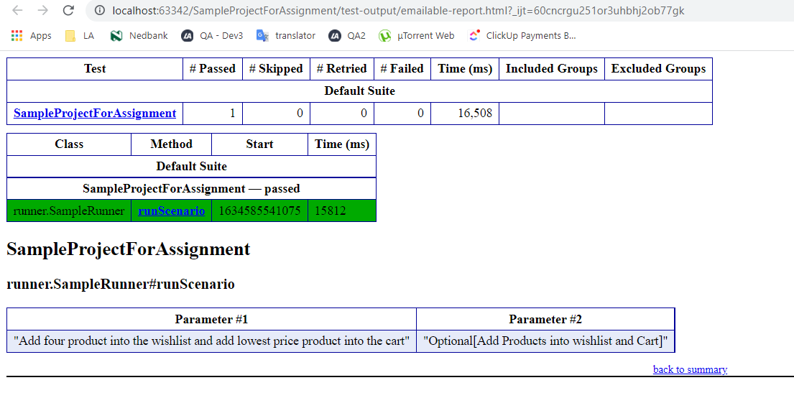

Sample cucumber Project 

Getting Started 

Dependencies: 

1. You need to install cucumber plugin with your editor 
2. Resolve all maven dependencies

Overview of the project:
- 
1. Main Package has utilities and page object class
2. Utilities contains the common methods of the project helper 
class and driver manager class
3. page object contains PO classes where we define all the methods and locators 
4. Test package contains runner steps and feature file 
5. Feature file is connected to the steps file and user can run via runner 
6. For generate the report open testNG Editor and check the report option from the Listeners
7. We can also integrate allure report and other but for that we need to some extra setup

Run the Project
- 
Open the SampleRunner and just click on the run button 

Report Directory 
- 
Test output folder will auto generated after the execution and emailable.html report will generated 

Test Execution Screenshot:
--
